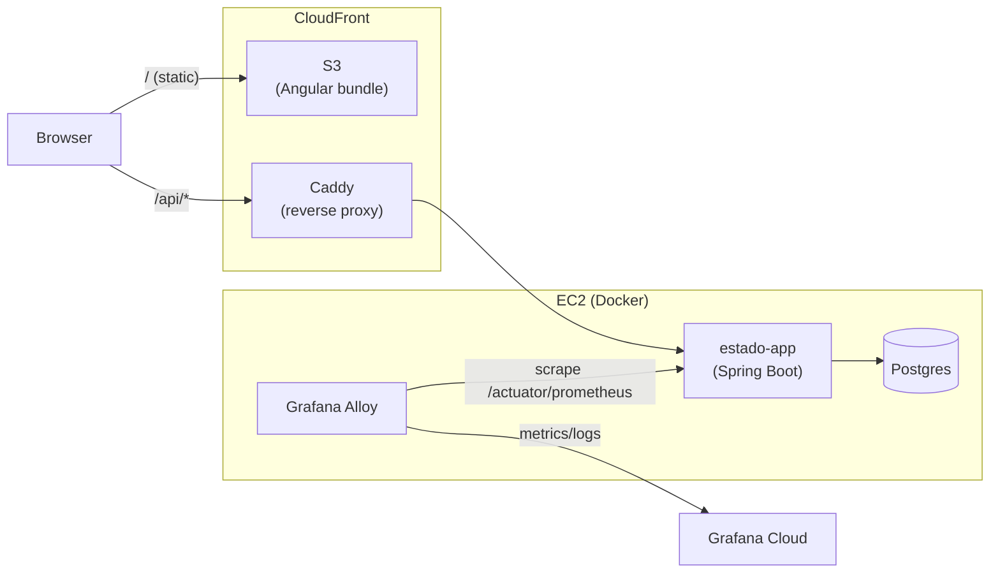

# Estado

🇧🇷 [Ler em português](README.pt-BR.md)

[](https://github.com/ronybrand/estado/actions/workflows/ci.yml)
[](https://github.com/ronybrand/estado/actions/workflows/codeql.yml)
[](https://codecov.io/gh/ronybrand/estado)

CRUD project for Brazilian federative units (states).

The Estado project is a system built on Java 25/Spring Boot 4, with Maven for dependency management and PostgreSQL as the database, exposing an HTTP service. The frontend (Angular, separate [`angular_estado`](https://github.com/ronybrand/angular_estado) repo) is served as a static bundle via S3 + CloudFront, with the API reachable at `/api/*` under the same domain (see ADR 0013). A second, alternate frontend for the same API exists in React: [`react_state`](https://github.com/ronybrand/react_state).

**Live**: https://d3bqbg07tehy1h.cloudfront.net/ (frontend, S3 + CloudFront) · API at
https://54.94.231.248.sslip.io/estado (also reachable via `/api/estado` under the same
CloudFront domain) — self-managed AWS deployment (EC2 + Docker + Caddy for the backend, S3 +
CloudFront for the frontend), with CI/CD, automated backups and failure recovery.
Infrastructure is provisioned via Terraform (imported from the real account, not written from
scratch — see [`terraform/`](terraform/)). The full story of the migration and deployment,
including the bugs found in production and the architecture decisions, is in
[`CASE_STUDY.md`](CASE_STUDY.md) and in [`docs/adr/`](docs/adr/).

## Architecture



A single EC2 instance runs the three Docker containers (app, Postgres, Alloy) via
Compose + `deploy.sh`, with a zero-downtime rolling swap triggered by a systemd
timer every 5min, whenever a new image lands in GHCR (see [`deploy/`](deploy/) and
`docs/adr/`). The frontend (separate
[`angular_estado`](https://github.com/ronybrand/angular_estado) repo) is
published independently to S3/CloudFront.

## Project structure

```
src/main/java/br/com/rony/spring/boot/estado/
├── Estado.java                    # JPA entity
├── EstadoController.java          # REST endpoints
├── EstadoService.java             # business logic
├── EstadoRepository.java          # Spring Data JPA
├── Estado{Create,Update}RequestDTO.java  # input payloads, one per operation
├── EstadoDTO.java                 # output payload
├── EstadoNaoEncontradoException.java
├── config/       # CORS, servlet filters (RequestIdFilter, ActuatorNoCacheFilter), UrlHandlerFilter
├── error/        # CustomGlobalExceptionHandler + ErrorResponseDto
└── property/     # ApiProperty (@ConfigurationProperties)
```

Package-by-feature, not package-by-layer: the `estado` feature's entity,
controller, service, repository and DTOs live together in the root package,
instead of spread across `controller/`, `service/`, `repository/` packages
etc. With a single feature in the project, the root package holds all of it;
`config/`, `error/` and `property/` are kept separate since they're
cross-cutting, not part of the feature itself.

Request DTOs are one per operation (`Create` vs `Update`) instead of a single
reused DTO — see the comment on `EstadoUpdateRequestDTO`/`EstadoCreateRequestDTO`
for why (each one fixes a real incomplete-payload bug).

The comment convention (what's worth explaining with a comment vs. what should
become a name) is documented in [`CLAUDE.md`](CLAUDE.md), not repeated here.

### Other top-level directories

| Folder | What's in it | Docs |
|---|---|---|
| [`deploy/`](deploy/) | Docker Compose, deploy/rollback/backup scripts and systemd units — what runs *inside* the EC2 instance, outside the jar | [`deploy/README.md`](deploy/README.md) |
| [`terraform/`](terraform/) | Modules (`portfolio-instance`, `app-backup`, `frontend-static`, `github-oidc-*`, `private-encrypted-bucket`) — AWS resources brought in via `import`, not recreated from scratch | [`docs/adr/`](docs/adr/) |
| [`.github/workflows/`](.github/workflows/) | `ci.yml` (build+test), `codeql.yml` (weekly SAST), `docker-publish.yml` (build+push to GHCR after CI passes on `master`), `terraform-drift-check.yml` (weekly plan), `dependabot-auto-merge.yml` (auto-merge for non-major bumps) | inline comments in each workflow |

## Features
- Register a federative unit one at a time, with registration date/time;
- Display the list of federative units;
- Allow updating a federative unit's full name and abbreviation, with updated date/time;
- Look up a federative unit by its Id;
- Delete a federative unit by its Id.
Notes: You may not insert/update a state name (or abbreviation) that already exists. Mutating
endpoints (create/update/delete) require a JWT obtained via `POST /auth/login` — single admin
user, no user table (see ADR 0017); `GET` stays public. All endpoints are also rate-limited per
IP (default 60 req/min, `429` when exceeded, see ADR 0016) as a baseline defense against abuse.

# 1 - Build with Maven and run locally with java -jar

Note: the steps below were put together for Windows.

## 1.1 Prerequisites
To build and run the application you need:
- [JDK 25](https://www.azul.com/downloads/?version=java-25-lts) or another OpenJDK 25 distribution
- [Maven 3.6.3+](https://maven.apache.org)
- An accessible PostgreSQL instance (local or remote)

## 1.2 Step by step
1.2.1 - [Download the project](https://github.com/ronybrand/estado/archive/master.zip)

1.2.2 - Unzip it, enter the unzipped directory

1.2.3 - Configure the database credentials via environment variables (there are no longer fixed credentials in `application.yml`):
```
set JDBC_DATABASE_URL=jdbc:postgresql://localhost:5432/estado
set JDBC_DATABASE_USERNAME=<user>
set JDBC_DATABASE_PASSWORD=<password>
```

1.2.4 - Run
- To run on the project's default port (8080), run the command below:
```
mvn spring-boot:run
```

# 2 - Browser - Local
The API is at http://localhost:8080/estado

Swagger UI (interactive API docs) is at http://localhost:8080/swagger-ui.html — enabled by
default in dev, explicitly disabled in production (see `deploy/estado/lib-swap.sh`).

The Angular UI is no longer embedded in this jar (see ADR 0013) — it lives in the separate
[`angular_estado`](https://github.com/ronybrand/angular_estado) repo, run locally with
`npm start` (`http://localhost:4200/`, proxying `/api` to this backend).

# 3 - Docker
You can also build and run it via container, without installing Maven/JDK locally:
```
docker build -t estado .
docker run -p 8080:8080 -e JDBC_DATABASE_URL=... -e JDBC_DATABASE_USERNAME=... -e JDBC_DATABASE_PASSWORD=... estado
```
The image published to production lives at `ghcr.io/ronybrand/estado` (published automatically
on every push to `master`, see [`.github/workflows/docker-publish.yml`](.github/workflows/docker-publish.yml)).

# 4 - Production
https://d3bqbg07tehy1h.cloudfront.net/ (frontend) — API at https://54.94.231.248.sslip.io/estado or
via `/api/estado` under the same CloudFront domain. Deployment details in [`CASE_STUDY.md`](CASE_STUDY.md).

The running build's commit and version are exposed at `/actuator/info`, handy for confirming that
a deploy (or rollback) applied the expected commit without having to check the `deploy.sh` log.
