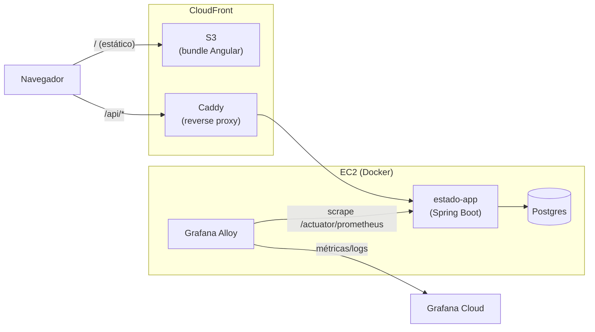

# Estado

🇬🇧 [Read in English](README.md)

[](https://github.com/ronybrand/estado/actions/workflows/ci.yml)
[](https://github.com/ronybrand/estado/actions/workflows/codeql.yml)
[](https://codecov.io/gh/ronybrand/estado)

Projeto CRUD de unidades federativas do Brasil (estados).

O Projeto Estado trata-se de um sistema sob arquitetura Java 25/Spring Boot 4, configuração de dependência em Maven e banco de dados PostgreSQL para disponibilização de um serviço HTTP. O front-end (Angular, repo [`angular_estado`](https://github.com/ronybrand/angular_estado) separado) é servido estático via S3 + CloudFront, com a API acessível em `/api/*` sob o mesmo domínio (ver ADR 0013). Existe um segundo front-end alternativo pra mesma API, em React: [`react_state`](https://github.com/ronybrand/react_state).

**No ar**: https://d3bqbg07tehy1h.cloudfront.net/ (frontend, S3 + CloudFront) · API em
https://54.94.231.248.sslip.io/estado (acessível também via `/api/estado` sob o mesmo domínio do
CloudFront) — deploy próprio na AWS (EC2 + Docker + Caddy pro backend, S3 + CloudFront pro frontend),
com CI/CD, backup automático e recuperação de falhas. Infra provisionada via Terraform (importada da
conta real, não escrita do zero — ver [`terraform/`](terraform/)). A história completa da migração e
do deploy, incluindo os bugs encontrados em produção e as decisões de arquitetura, está em
[`CASE_STUDY.md`](CASE_STUDY.md) e em [`docs/adr/`](docs/adr/).

## Arquitetura



Um único EC2 roda os três containers Docker (app, Postgres, Alloy) via Compose +
`deploy.sh`, com rolling swap sem downtime disparado por um timer systemd a cada
5min, sempre que uma nova imagem chega no GHCR (ver [`deploy/`](deploy/) e
`docs/adr/`). O frontend (repo
[`angular_estado`](https://github.com/ronybrand/angular_estado) separado) é
publicado independentemente em S3/CloudFront.

## Estrutura do projeto

```
src/main/java/br/com/rony/spring/boot/estado/
├── Estado.java                    # entidade JPA
├── EstadoController.java          # endpoints REST
├── EstadoService.java             # regra de negócio
├── EstadoRepository.java          # Spring Data JPA
├── Estado{Create,Update}RequestDTO.java  # payloads de entrada, um por operação
├── EstadoDTO.java                 # payload de saída
├── EstadoNaoEncontradoException.java
├── config/       # CORS, filtros de servlet (RequestIdFilter, ActuatorNoCacheFilter), UrlHandlerFilter
├── error/        # CustomGlobalExceptionHandler + ErrorResponseDto
└── property/     # ApiProperty (@ConfigurationProperties)
```

Package-by-feature (pacote por funcionalidade), não package-by-layer: entidade,
controller, service, repository e DTOs da feature `estado` vivem juntos no
pacote raiz, em vez de espalhados em pacotes `controller/`, `service/`,
`repository/` etc. Com uma única feature no projeto, o pacote raiz concentra
tudo dela; `config/`, `error/` e `property/` ficam à parte por serem
transversais, não parte da feature em si.

Os DTOs de request são um por operação (`Create` vs `Update`) em vez de um DTO
único reaproveitado — ver comentário em `EstadoUpdateRequestDTO`/`EstadoCreateRequestDTO`
pro motivo (cada um corrige um bug real de payload incompleto).

Convenção de comentários (o que vale explicar com comentário vs. o que deve
virar nome) está documentada em [`CLAUDE.md`](CLAUDE.md), não repetida aqui.

### Outros diretórios de topo

| Pasta | O que tem | Documentação |
|---|---|---|
| [`deploy/`](deploy/) | Docker Compose, scripts de deploy/rollback/backup e units systemd — o que roda *dentro* da EC2, fora do jar | [`deploy/README.md`](deploy/README.md) |
| [`terraform/`](terraform/) | Módulos (`portfolio-instance`, `app-backup`, `frontend-static`, `github-oidc-*`, `private-encrypted-bucket`) — recursos AWS trazidos via `import`, não recriados do zero | [`docs/adr/`](docs/adr/) |
| [`.github/workflows/`](.github/workflows/) | `ci.yml` (build+test), `codeql.yml` (SAST semanal), `docker-publish.yml` (build+push no GHCR após CI passar em `master`), `terraform-drift-check.yml` (plan semanal), `dependabot-auto-merge.yml` (merge automático de bump não-major) | comentários inline em cada workflow |

## Funcionalidades:
- Cadastrar uma unidade federativa por vez com data e hora do registro;
- Apresentar a lista das unidades federativas;
- Permitir alterar o nome completo e sigla das unidades federativas com data e hora atualizadas;
- Consultar a unidade da federação pelo seu Id;
- Excluir uma unidade da federação passando seu Id.
Observações: Não é permitido inserir/alterar um nome de estado que já exista ou mesmo para sigla.
Endpoints de mutação (criar/alterar/excluir) exigem um JWT obtido via `POST /auth/login` —
usuário admin único, sem tabela de usuários (ver ADR 0017); `GET` continua público. Todos os
endpoints também têm rate limit por IP (padrão 60 req/min, `429` quando excedido, ver ADR 0016)
como defesa básica contra abuso.

# 1 - Compilar com Maven e executar local com java -jar

Observação: os passos abaixo foram montandos para Windows.

## 1.1 Pre-requisistos
Para construir e rodar a aplicação você precisa de:
- [JDK 25](https://www.azul.com/downloads/?version=java-25-lts) ou outra distribuição OpenJDK 25
- [Maven 3.6.3+](https://maven.apache.org)
- Um PostgreSQL acessível (local ou remoto)

## 1.2 Passo a passo
1.2.1 - [Baixar o projeto](https://github.com/ronybrand/estado/archive/master.zip)

1.2.2 - Descompacte o zip, entre no diretório descompactado

1.2.3 - Configure as credenciais do banco via variáveis de ambiente (não há mais credenciais fixas no `application.yml`):
```
set JDBC_DATABASE_URL=jdbc:postgresql://localhost:5432/estado
set JDBC_DATABASE_USERNAME=<usuario>
set JDBC_DATABASE_PASSWORD=<senha>
```

1.2.4 - Rodar
- Para rodar usando a porta padrão do projeto (8080), execue o comando abaixo:
```
mvn spring-boot:run
```

# 2 - Navegador - Local
A API fica em http://localhost:8080/estado

Swagger UI (documentação interativa da API) fica em http://localhost:8080/swagger-ui.html — habilitado
por padrão em dev, desligado explicitamente em produção (ver `deploy/estado/lib-swap.sh`).

A interface Angular não roda mais embutida neste jar (ver ADR 0013) — está no repo separado
[`angular_estado`](https://github.com/ronybrand/angular_estado), rodada localmente com `npm start`
(`http://localhost:4200/`, com proxy pra `/api` -> este backend).

# 3 - Docker
Também dá pra buildar e rodar via container, sem instalar Maven/JDK localmente:
```
docker build -t estado .
docker run -p 8080:8080 -e JDBC_DATABASE_URL=... -e JDBC_DATABASE_USERNAME=... -e JDBC_DATABASE_PASSWORD=... estado
```
A imagem publicada em produção fica em `ghcr.io/ronybrand/estado` (publicada automaticamente a
cada push na `master`, ver [`.github/workflows/docker-publish.yml`](.github/workflows/docker-publish.yml)).

# 4 - Produção
https://d3bqbg07tehy1h.cloudfront.net/ (frontend) — API em https://54.94.231.248.sslip.io/estado ou
via `/api/estado` no mesmo domínio do CloudFront. Detalhes do deploy em [`CASE_STUDY.md`](CASE_STUDY.md).

O commit e a versão do build em execução ficam expostos em `/actuator/info`, útil pra confirmar que
um deploy (ou rollback) aplicou o commit esperado sem precisar consultar o log do `deploy.sh`.
